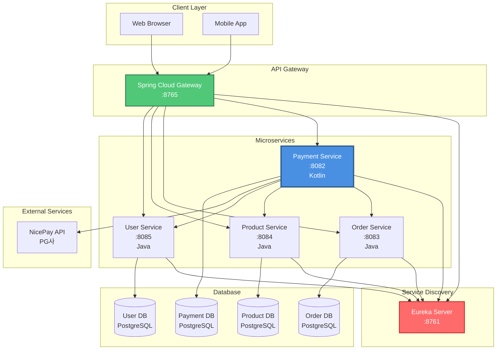
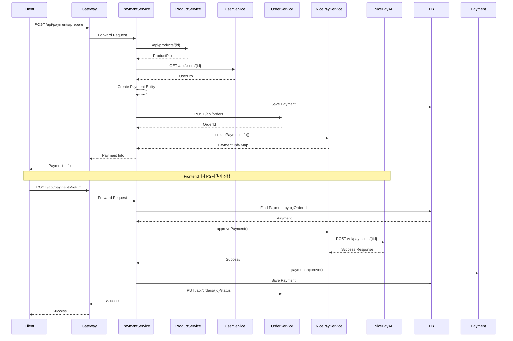

# Payment Service

결제 서비스 마이크로서비스입니다. Kotlin으로 작성되었으며, Spring Boot와 Spring Cloud를 기반으로 합니다.

## 📋 목차

- [개요](#개요)
- [아키텍처](#아키텍처)
- [기술 스택](#기술-스택)
- [주요 기능](#주요-기능)
- [프로젝트 구조](#프로젝트-구조)
- [시작하기](#시작하기)
- [API 문서](#api-문서)
- [테스트](#테스트)

## 🎯 개요

Payment Service는 S-Class Platform의 결제 기능을 담당하는 마이크로서비스입니다.

### 주요 특징

- **마이크로서비스 아키텍처**: 독립적으로 배포 가능한 서비스
- **Kotlin 기반**: 간결하고 안전한 코드
- **Rich Domain Model**: 도메인 로직을 엔티티에 포함
- **다중 PG사 지원**: NicePay, Toss, KakaoPay 등
- **비동기 처리**: WebClient를 사용한 비동기 API 호출

## 🏗️ 아키텍처

### 전체 마이크로서비스 아키텍처

### Payment Service 내부 아키텍처

```mermaid
graph TB
    subgraph "API Layer"
        Controller[PaymentController<br/>REST API]
    end

    subgraph "Service Layer"
        PaymentService[PaymentService<br/>비즈니스 로직 오케스트레이션]
        NicePayService[NicePayService<br/>PG사 통신]
    end

    subgraph "Domain Layer"
        Payment[Payment Entity<br/>Rich Domain Model]
        PaymentStatus[PaymentStatus Enum]
    end

    subgraph "Infrastructure Layer"
        PaymentRepository[PaymentRepository<br/>JPA]
        OrderClient[OrderServiceClient<br/>Feign]
        ProductClient[ProductServiceClient<br/>Feign]
        UserClient[UserServiceClient<br/>Feign]
        WebClient[WebClient<br/>HTTP Client]
    end

    subgraph "External"
        OrderService[Order Service]
        ProductService[Product Service]
        UserService[User Service]
        NicePayAPI[NicePay API]
    end

    subgraph "Database"
        DB[(PostgreSQL)]
    end

    Controller --> PaymentService
    PaymentService --> NicePayService
    PaymentService --> PaymentRepository
    PaymentService --> OrderClient
    PaymentService --> ProductClient
    PaymentService --> UserClient

    PaymentRepository --> Payment
    PaymentRepository --> DB

    NicePayService --> WebClient
    NicePayService --> NicePayConfig

    OrderClient --> OrderService
    ProductClient --> ProductService
    UserClient --> UserService
    WebClient --> NicePayAPI

    PaymentService --> Payment

    style PaymentService fill:#4A90E2,stroke:#2E5C8A,stroke-width:2px,color:#fff
    style Payment fill:#9B59B6,stroke:#6C3483,stroke-width:2px,color:#fff
    style NicePayService fill:#E67E22,stroke:#A04000,stroke-width:2px,color:#fff
```

### 결제 플로우

## 🛠️ 기술 스택

### Backend
- **Language**: Kotlin 1.9+
- **Framework**: Spring Boot 3.x
- **Build Tool**: Gradle (Kotlin DSL)

### Spring Cloud
- **Spring Cloud Gateway**: API Gateway
- **Spring Cloud Netflix Eureka**: Service Discovery
- **Spring Cloud OpenFeign**: Service-to-Service Communication

### Database
- **PostgreSQL**: 관계형 데이터베이스
- **Spring Data JPA**: ORM

### External Communication
- **WebClient**: 비동기 HTTP Client (NicePay API 통신)
- **Feign Client**: 동기 HTTP Client (마이크로서비스 간 통신)

### Testing
- **JUnit 5**: 테스트 프레임워크
- **Mockito Kotlin**: Mocking 라이브러리
- **AssertJ**: Assertion 라이브러리

### Documentation
- **OpenAPI 3 (Swagger)**: API 문서화

## ✨ 주요 기능

### 1. 결제 준비 (Prepare Payment)
- 상품 정보 조회
- 사용자 정보 조회
- Payment 엔티티 생성
- Order 생성
- PG사 결제 정보 생성

### 2. 결제 승인 (Approve Payment)
- PG사 API 호출
- Payment 상태 업데이트
- Order 상태 업데이트
- 예외 처리 및 실패 처리

### 3. 결제 조회
- 사용자별 결제 내역 조회
- 결제 상태별 조회
- 페이징 지원

## 📁 프로젝트 구조
